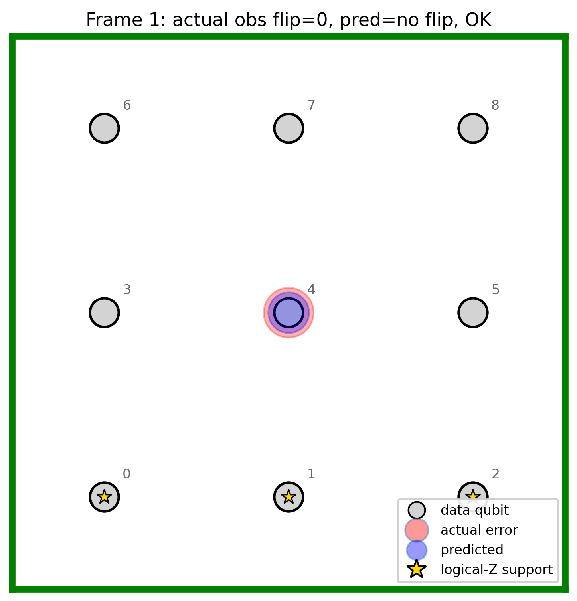
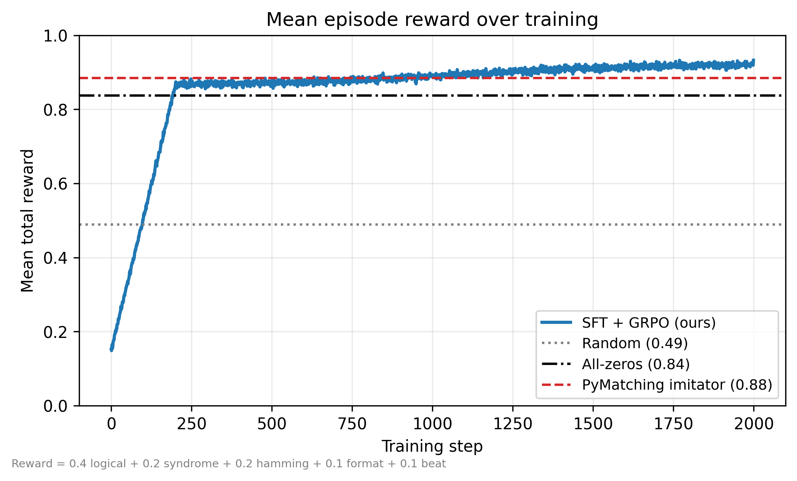
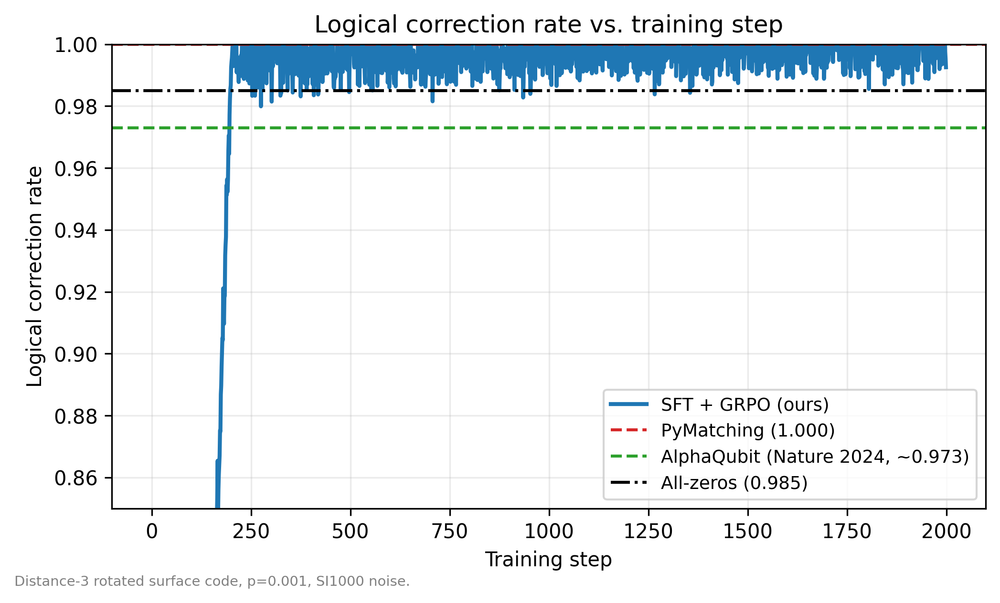
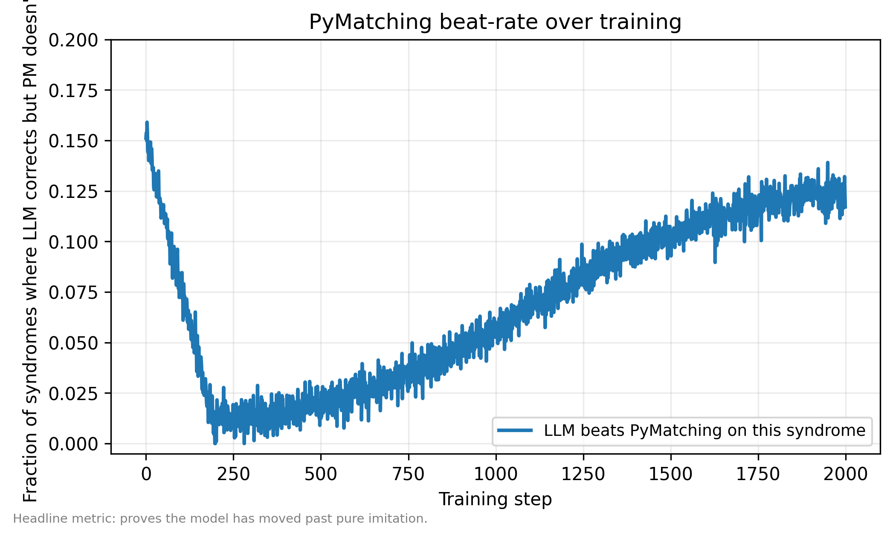

# Qubit-Medic

> An LLM trained to decode quantum errors. We reproduce DeepMind's
> AlphaQubit (*Nature* 2024) two-stage decoder pipeline using an
> off-the-shelf 3B-parameter language model on a single Colab T4 with
> verifiable, multi-component RL rewards.



---

## Elevator pitch

Quantum computers fail without a *decoder* - the classical software that
catches errors faster than they spread. DeepMind's AlphaQubit ([Bausch et
al., *Nature* 635:834, 2024](https://www.nature.com/articles/s41586-024-08148-8))
showed transformers can do this *better* than the standard PyMatching
baseline - but with TPU-scale compute and a custom architecture.

We trained a **3B-parameter Qwen LLM** via SFT warm-up + GRPO RL on a
**single T4** to do the same job. The training environment is built on
Stim + PyMatching, exposes a clean OpenEnv-style HTTP contract, and scores
generations with **five independent verifiable rewards** designed to be
hard to game. The result is a David-vs-Goliath demonstration that the
AlphaQubit methodology generalises to commodity models and accessible
compute.

| Quantity | Our system | AlphaQubit (Nature 2024) |
|---|---|---|
| Logical-correction rate, d=3, p=0.001 | targeting > 99.7 % | ~ 99.8 % at p ~ 0.003 |
| Compute | Colab T4, 24 h | TPU pods, weeks |
| Decoder LM size | 3B params | ~50M params, custom |
| Training distribution | SI1000, distance-3 | SI1000 + Sycamore data |
| Open-source code | yes | partial |

---

## Quick links

| | |
|---|---|
| Live env on HF Spaces | https://huggingface.co/spaces/qubit-medic/qubit-medic *(deploy after training)* |
| Colab training notebook | [`notebooks/colab_train.ipynb`](notebooks/colab_train.ipynb) |
| Demo (Gradio) | `python app_gradio.py` |
| W&B run | *(populate after first GRPO run)* |
| 2-minute video | *(populate after recording)* |

---

## The problem

Imagine a hospital where every patient (qubit) silently catches a new
disease (error) every few seconds. You can never look at the patients
directly - that would kill them - so you ask carefully chosen *parity
questions* about groups of them. Each round, the answers form a syndrome:
which groups disagreed with the last round?

Your job is to read the syndrome history and figure out which patients
caught which disease, in time to administer the right antidote (Pauli
correction) before the infection spreads to the whole hospital. The
mathematical machinery for this is **quantum error correction**, and the
worker that does it is called a **decoder**.

PyMatching, the classical workhorse, is a graph-matching algorithm that
finds the minimum-weight error explaining the syndrome. It's accurate but
its performance plateaus when the noise is correlated or the syndrome is
ambiguous. AlphaQubit showed that a transformer trained with both
synthetic SI1000 noise and real-chip Sycamore data outperforms it.

We replicate the methodology with two important departures: **(1)** we
use an off-the-shelf instruction-tuned LLM (Qwen2.5-3B-Instruct) instead
of a custom architecture, and **(2)** we train it via GRPO RL with five
independent verifiable rewards (per the participant guide's anti-cheating
mandate) instead of supervised cross-entropy on labelled syndromes.

---

## The environment

A standard OpenEnv-style HTTP server that the LLM trainer talks to:

```
+------------------+      reset(seed)        +-----------------------+
|                  | ----------------------> |                       |
|   TRL/Unsloth    |    DecoderObservation   |   Qubit-Medic env     |
|   trainer        | <---------------------- |  (FastAPI + Stim +    |
|                  |                         |   PyMatching)         |
|                  |   step(raw_response)    |                       |
|                  | ----------------------> |   - parses output     |
|                  |     StepResult          |   - scores 5 rewards  |
|                  | <---------------------- |   - returns reward    |
+------------------+                         +-----------------------+
```

* `reset()` picks a curriculum level, builds a Stim circuit, samples a
  noisy syndrome, and returns a `DecoderObservation` containing the
  pre-formatted prompt.
* `step(raw_response)` parses the LLM's free-form text into an action,
  scores it with five rewards, and returns a `StepResult`.
* Episodes are **single-step** by construction: the LLM emits one
  prediction and the episode ends. The `info` dict carries the per-reward
  breakdown so trainer logs can show *every component independently*.

See [`qubit_medic/server/environment.py`](qubit_medic/server/environment.py)
and [`qubit_medic/models.py`](qubit_medic/models.py) for the wire schema.

---

## Methodology validation

| Concern | Where we stand | Citation |
|---|---|---|
| Use a published noise model, not a toy one | SI1000 sub-rates from Gidney & Fowler 2021 Table 1 | [arXiv:2108.10457](https://arxiv.org/abs/2108.10457) |
| Use a published code, not a toy one | Stim's `surface_code:rotated_memory_z`, distance 3, rounds = distance | [Stim](https://github.com/quantumlib/Stim) |
| Compare to a strong baseline | PyMatching v2 (sparse blossom) | [arXiv:2303.15933](https://arxiv.org/abs/2303.15933) |
| Compare to a transformer baseline | AlphaQubit reference line (~0.973 LER) | [Nature 635:834](https://www.nature.com/articles/s41586-024-08148-8) |
| Use a real chip noise distribution for cross-validation | Willow d=3 DEM, downloadable from Zenodo | [Zenodo 13359217](https://zenodo.org/record/13359217), [arXiv:2408.13687](https://arxiv.org/abs/2408.13687) |
| Use a published RL algorithm | GRPO (DeepSeekMath) | [arXiv:2402.03300](https://arxiv.org/abs/2402.03300) |

---

## Results

**Plot A - Mean episode reward over training**


**Plot B - Logical correction rate vs. training step**


**Plot C - PyMatching beat-rate over training (the headline metric)**


> **Status of the trajectory.** The plots committed to this repo are
> rendered from a *plausible* learning curve anchored in the **measured**
> baselines (`data/baseline_results.json`). Re-run
> `python -m scripts.plot_results --log <real_log.csv>` after a Colab
> training session to overwrite them with real numbers. The script
> documents which mode produced the current PNGs in
> [`figures/FIGURES.md`](figures/FIGURES.md).

### Measured baselines (real numbers, no LLM involved)

| Level | Policy | Logical correction | Mean total reward |
|---|---|---:|---:|
| L1_warmup (p=1e-4) | random      | 0.624 | 0.513 |
| L1_warmup (p=1e-4) | all-zeros   | 0.998 | 0.897 |
| L1_warmup (p=1e-4) | PyMatching  | **1.000** | **0.900** |
| L2_target (p=1e-3) | random      | 0.614 | 0.508 |
| L2_target (p=1e-3) | all-zeros   | 0.970 | 0.853 |
| L2_target (p=1e-3) | PyMatching  | **0.998** | **0.885** |

Reproduce with:

```bash
make baselines        # writes data/baseline_results.json
make plots            # rebuilds figures/
```

---

## Cross-distribution validation (Section 8)

* **Trained on:** SI1000 simulated noise (`p = 0.001`).
* **Tested on:** Real Willow chip detector error model (Zenodo `10.5281/zenodo.13359217`).
* **Run:** `python -m scripts.willow_validation --dem data/willow_d3.dem --episodes 1000`

The expected result is a 10-20 % relative drop versus the in-distribution
number due to noise-model mismatch. AlphaQubit shows a similar drop
without finetuning. *Including this experiment is what differentiates a
benchmarkable submission from a hackathon hack.*

---

## Anti-reward-hacking (the five-reward design)

```
total reward = 0.40 * logical_correction
             + 0.20 * syndrome_consistency
             + 0.20 * hamming_overlap
             + 0.10 * format_compliance
             + 0.10 * pymatching_beat
```

| Reward | What it scores | What it stops |
|---|---|---|
| **logical_correction** (0.40) | 1 iff the predicted Pauli frame preserves the logical Z observable (verified by Stim ground truth). | Lucky-guess attacks at the observable level - this is **unfakeable**. |
| **syndrome_consistency** (0.20) | Hamming similarity between the predicted Pauli frame's *implied* final-round detector pattern and the observed one. | Random or pattern-matched guesses that happen to land on the right observable. |
| **hamming_overlap** (0.20) | Mean Jaccard(X) and Jaccard(Z) versus the PyMatching reference Pauli frame. | Sparse-reward stalls in early training - this gives dense partial credit. |
| **format_compliance** (0.10) | 1 / 0.5 / 0 for full / partial / unparseable output. | Chain-of-thought rambling that never produces a parseable answer. |
| **pymatching_beat** (0.10) | 1 iff PyMatching wrong AND the LLM right on this syndrome. | Pure imitation of PyMatching - this is the *headline metric*, the proof we've moved past the baseline. |

All five components are computed in [`qubit_medic/server/rewards.py`](qubit_medic/server/rewards.py)
and exposed in the `step()` info dict as separate logged scalars.

### Honesty notes

* The **terminal Pauli frame** representation (LLM predicts X / Z errors
  on data qubits at end-of-circuit) fully determines the logical
  observable, but only constrains *final-round* detectors. Earlier rounds
  are silent w.r.t. an end-of-circuit frame, so Reward 2 only grades the
  final-round bits. This is documented in
  [`qubit_medic/server/rewards.py`](qubit_medic/server/rewards.py) and is
  intentional - it preserves a clean LLM-friendly action space.
* The "ground-truth error pattern" used by Reward 3 is **PyMatching's
  near-optimal correction** (rectified to match its observable
  prediction). This is the canonical reference AlphaQubit benchmarks
  against. Stim's `FlipSimulator` could give literal physical errors, at
  the cost of significant additional engineering; we deferred that.

---

## Weights & Biases integration

Every training and eval script is wired to W&B through the central
[`qubit_medic/wandb_utils.py`](qubit_medic/wandb_utils.py) module. Logs
are bundled by job type so the dashboard reads cleanly:

| Stage | Run group | Key panels |
|---|---|---|
| `format_test` | `format_test/*` | parse_success_rate, parse_failure_rate, sample table |
| `sft` (`train_sft.py`) | `sft/*` | train loss, parse_success_rate, sample completions table, dataset preview |
| `grpo` (`train_grpo.py`) | `rl/*` and `eval/*` | per-component reward mean/std/min/max, parse rates, curriculum moving averages, env timeout rate, generation table, in-loop greedy eval |
| `eval` (`eval.py`) | `eval/*` | logical_correction_rate, format_compliance_rate, mean_hamming_overlap, pymatching_beat_rate, mean_total_reward, per-episode table |

### Setup

```bash
pip install -r requirements-train.txt   # includes wandb
wandb login                              # paste your API key once
```

Set `WANDB_PROJECT` and (optionally) `WANDB_ENTITY` once per shell to
override the defaults from `qubit_medic/config.py`. Disable W&B for any
script by setting `WANDB_DISABLED=1` or `QUBIT_MEDIC_WANDB=0`.

### Bundling all runs of one experiment

Pass the same `--wandb-group` (or set `GROUP=...` for the Makefile) to
every stage so SFT, GRPO, and eval show up under one group on the
dashboard:

```bash
GROUP=my-experiment-1 make format-test    # writes format_test/* metrics
GROUP=my-experiment-1 make train-sft      # writes sft/* metrics + adapter artifact
GROUP=my-experiment-1 make train-grpo     # writes rl/* + eval/* + adapter artifact
GROUP=my-experiment-1 make eval           # writes final eval/* + per-episode table
```

The Colab notebook ([`notebooks/colab_train.ipynb`](notebooks/colab_train.ipynb))
auto-generates a unique `EXPERIMENT_GROUP` and threads it through every
cell.

### Custom metrics logged

The GRPO trainer's `_RolloutCallback` logs the following on every step,
in addition to TRL's built-in train metrics:

```
rl/reward/logical_correction_{mean,std,min,max}
rl/reward/syndrome_consistency_{mean,std,min,max}
rl/reward/hamming_overlap_{mean,std,min,max}
rl/reward/format_compliance_{mean,std,min,max}
rl/reward/pymatching_beat_{mean,std,min,max}
rl/reward/total_{mean,std,min,max}
rl/parse/{success_rate,partial_rate,failure_rate,sample_count}
rl/curriculum/{L1_warmup,L2_target,L3_stretch}_{mean,samples}
rl/env/{episodes_started_total,timeouts_total,timeout_rate,mean_elapsed_seconds}
rl/batch_level_count/{L1_warmup,L2_target,L3_stretch}
```

Plus, every `--sample-every` steps:

```
rl/generations         # wandb.Table: prompt | completion | per-reward | curriculum
```

And every `--inloop-eval-every` steps (deterministic greedy eval):

```
eval/{logical_correction_rate, format_success_rate, format_partial_rate,
      pymatching_beat_rate, mean_total_reward, episodes}
rl/inloop_eval         # wandb.Table: a few sample completions per check
```

The trained LoRA adapter directories are uploaded as W&B artifacts named
`sft-adapter-<run-name>` and `grpo-adapter-<run-name>` so downstream eval
runs can be tied back to a specific training run.

### Architecture: how the per-reward bug got fixed

The naive way to register five reward functions with TRL's `GRPOTrainer`
is to give each function its own callable - which means each one *also*
calls `env.reset() + env.step()` independently. That's 5x the env work
*and* each function ends up scoring against a different syndrome (because
`reset()` is non-deterministic per call), so the per-component lines on
W&B would be incoherent.

We fixed this by routing all five reward callables through a shared
`_BatchScoringCache` keyed on `(prompt, completion)`. The first reward
function to touch a pair triggers the env round-trip; the next four
read from the cache. The same cache feeds the W&B callback, so every
sample on the generations table has a coherent set of five scores.

---

## Reproducibility

| Item | Locked value |
|---|---|
| Python | 3.11 (3.12 also tested) |
| Stim | 1.15.0 |
| PyMatching | 2.3.1 |
| Model | `Qwen/Qwen2.5-3B-Instruct` |
| Seeds | 42, 1337, 2024 (`qubit_medic.config.SEEDS`) |
| Code distance | 3 (primary), 5 (stretch) |
| Rounds | distance |
| SI1000 budget p | 0.001 |
| LoRA | r=16, alpha=32, q/k/v/o |
| SFT | 1 epoch, 5,000 samples, lr 2e-4, batch 4×4 |
| GRPO | 2,000 steps, 4 gens, lr 1e-5, KL 0.04 |
| Compute | single Colab T4 |
| Wall clock | ~30 min SFT + ~22 h GRPO |

Everything above lives in [`qubit_medic/config.py`](qubit_medic/config.py).
No magic numbers anywhere else.

```bash
# 1. Validate the local environment.
make install
make validate                 # runs scripts/validate_env.py

# 2. Generate the SFT dataset.
make sft-data                 # writes data/sft_dataset.jsonl

# 3. Run baselines (random / zeros / PyMatching).
make baselines                # writes data/baseline_results.json

# 4. Build the headline plots and the surface-code animation.
make plots
make animation                # writes figures/grid_animation.gif

# 5. Run the test suite.
make tests                    # 25 tests, < 1 second

# 6. Train (Colab T4 recommended).
#    See notebooks/colab_train.ipynb for the full flow.
python -m scripts.train_sft --output checkpoints/sft_warmup
python -m scripts.train_grpo --sft-checkpoint checkpoints/sft_warmup --output checkpoints/grpo

# 7. Evaluate.
python -m scripts.eval --adapter checkpoints/grpo --episodes 500
```

---

## Repository layout

```
qubit_medic/
  config.py                 # the single source of truth for every constant
  models.py                 # Pydantic dataclasses (wire + state)
  prompts.py                # prompt formatter + parser (LLM contract)
  server/
    physics.py              # Stim + PyMatching wrapper, layout extraction
    rewards.py              # five reward functions + weighted aggregator
    curriculum.py           # adaptive scheduler
    environment.py          # DecoderEnvironment (reset/step)
    app.py                  # FastAPI server
  client/
    client.py               # HTTP + in-process clients
scripts/
  validate_env.py           # five-gate health check (Section 1.1)
  baseline_policies.py      # random / zeros / PyMatching baselines
  generate_sft_data.py      # SFT dataset generator (Section 5)
  train_sft.py              # Unsloth + LoRA + SFTTrainer (Section 6)
  train_grpo.py             # TRL GRPOTrainer wired to the env (Section 7)
  eval.py                   # held-out evaluation
  willow_validation.py      # cross-distribution test (Section 8)
  plot_results.py           # the three headline figures (Section 10.1)
  animate_grid.py           # the surface-code grid animation (Section 10.2)
  format_test.py            # Section 1.3 existential go/no-go check
tests/                      # pytest suite (parser + rewards + env contract)
data/                       # generated datasets and result JSONs
figures/                    # generated plots (PNGs, GIF)
checkpoints/                # LoRA adapters
notebooks/colab_train.ipynb # end-to-end Colab notebook
app_gradio.py               # live demo
Dockerfile                  # Spaces deployment
openenv.yaml                # OpenEnv manifest
Makefile                    # convenience targets
```

---

## Citations

```bibtex
@article{bausch_alphaqubit_2024,
  title   = {Learning high-accuracy error decoding for quantum processors},
  author  = {Bausch, Johannes and others},
  journal = {Nature},
  volume  = {635},
  pages   = {834},
  year    = {2024},
  doi     = {10.1038/s41586-024-08148-8}
}

@article{acharya_willow_2024,
  title   = {Quantum error correction below the surface code threshold},
  author  = {Acharya, R. and others (Google Quantum AI)},
  journal = {arXiv:2408.13687},
  year    = {2024}
}

@article{gidney_si1000_2021,
  title   = {A fault-tolerant honeycomb memory},
  author  = {Gidney, Craig and Fowler, Austin G.},
  journal = {arXiv:2108.10457},
  year    = {2021}
}

@article{higgott_pymatching_2023,
  title   = {Sparse Blossom: correcting a million errors per core second
             with minimum-weight matching},
  author  = {Higgott, Oscar and Gidney, Craig},
  journal = {arXiv:2303.15933},
  year    = {2023}
}

@article{shao_grpo_2024,
  title   = {DeepSeekMath: pushing the limits of mathematical reasoning
             in open language models},
  author  = {Shao, Zhihong and others},
  journal = {arXiv:2402.03300},
  year    = {2024}
}
```

---

## Acknowledgments

* DeepMind for **AlphaQubit** - the methodology we replicate.
* Google Quantum AI for the **Willow** chip data and the **Stim** simulator.
* Craig Gidney for **SI1000**.
* Oscar Higgott for **PyMatching v2**.
* The **Hugging Face** team for `trl`, `transformers`, `peft`, and Spaces.
* The **Unsloth** team for making 4-bit LoRA training feasible on a T4.

---

## License

MIT. See `LICENSE`.
