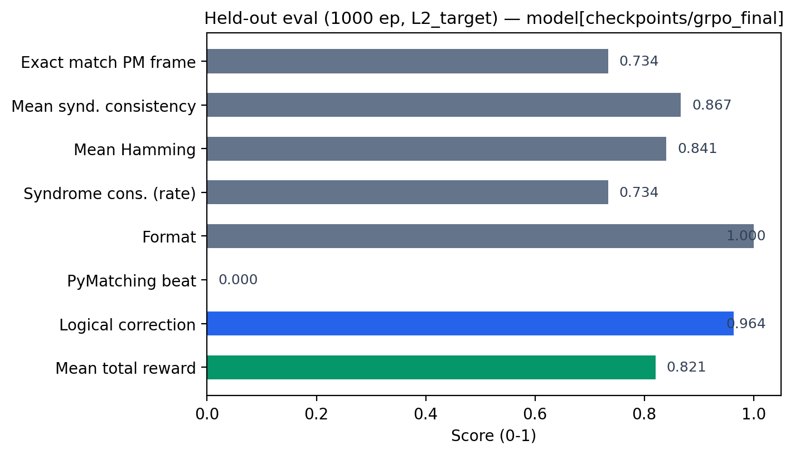
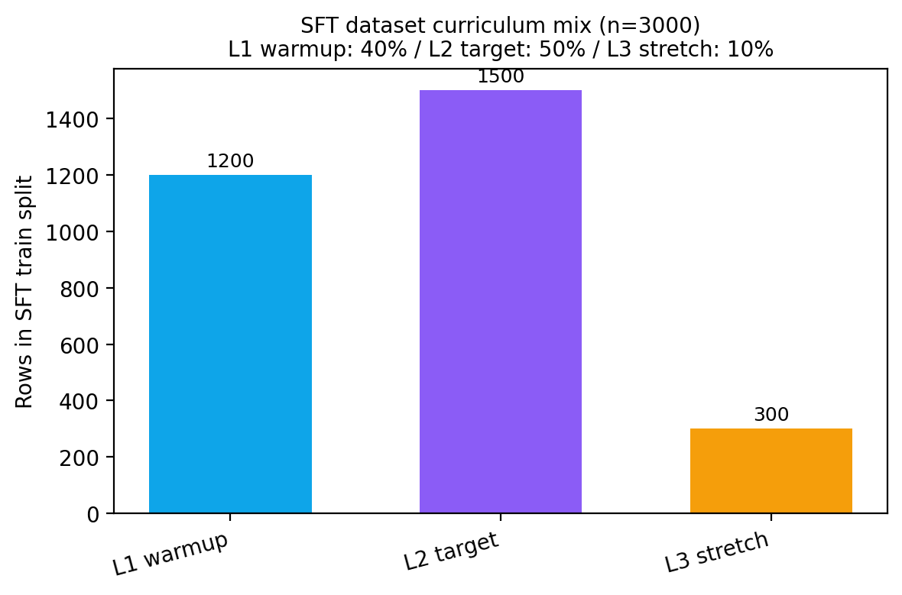

# QuantumScribe: An LLM Decoder for Quantum Error Correction

An LLM (Qwen2.5-3B-Instruct) learning to outperform a 50-year-old graph-matching algorithm (PyMatching) at decoding quantum surface-code syndromes — using verifiable physics rewards, not human preferences. DeepMind's AlphaQubit (*Nature* 2024, Bausch et al.) showed a transformer can beat strong classical decoders, but it cost Google millions of dollars and a custom architecture. We ship a 3B-parameter open model on a free Colab T4, trained with SFT + GRPO against a real Stim simulator behind an OpenEnv HTTP contract.


## Quick links

- **HF Space (live demo + API):** [ronitraj/QuantumScribe](https://huggingface.co/spaces/ronitraj/QuantumScribe) — health: [`/healthz`](https://ronitraj-quantumscribe.hf.space/healthz)
- **Trained LoRA on the Hub:** [ronitraj/quantumscribe](https://huggingface.co/ronitraj/quantumscribe)
- **Colab notebook (actual training run):** [`notebooks/meta_final.ipynb`](notebooks/meta_final.ipynb)
- **2-min video:** <!-- TODO: replace with submission video URL -->TBD-replace
- **Blog for Everyone:** [`BLOG.md`](BLOG.md)
- **W&B project:** [ronitraj/QuantumScribe-GRPO](https://wandb.ai/ronitraj/QuantumScribe-GRPO) · SFT [`yli513jl`](https://wandb.ai/ronitraj/QuantumScribe-GRPO/runs/yli513jl) · GRPO [`4p7eurnc`](https://wandb.ai/ronitraj/QuantumScribe-GRPO/runs/4p7eurnc)
- **OpenEnv manifest:** [`openenv.yaml`](openenv.yaml)


---

## What the agent learns

The agent observes a **surface-code syndrome** (detector parities from a `surface_code:rotated_memory_z` Stim circuit) and must emit a **Pauli frame** that preserves the encoded logical Z observable. Episodes are single-step: one syndrome in, one parseable correction out, scored by Stim's real physics — not a learned reward model. Across the curriculum, the policy moves from clean distance-3 codes to noisier multi-round circuits where PyMatching starts to fail.

We generate synthetic surface-code syndromes using **Stim** ([Gidney 2021](https://arxiv.org/abs/2103.02202)), the same Clifford simulator used by the AlphaQubit and Willow papers. This ensures our training data is drawn from the same physical model as the published benchmarks — not a homemade simulator.


## Environment

| Field | Value |
|---|---|
| Observation | `QubitMedicObservation` — `prompt` (text), `syndrome` bits, `level`, `episode_id`, curriculum metadata (see [`qubit_medic/server/openenv_adapter.py`](qubit_medic/server/openenv_adapter.py)) |
| Action | `QubitMedicAction` — `text` field containing the model's parseable Pauli-frame completion |
| Episode end | Single-step: terminates after one `step()` call; reward + per-component `info` returned to trainer |
| Curriculum | L1_warmup (d=3, 1 round, p=1e-4) → L2_target (d=3, 3 rounds, p=1e-3) → L3_stretch (d=5, 5 rounds, p=1e-3) with promotion thresholds 0.80 / 0.70 / 0.30 |

Server endpoints (FastAPI, port 7860): `/reset`, `/step`, `/state`, `/schema`, `/metadata`, `/health`, `/healthz`, `/decode` (PyMatching baseline). See [`openenv.yaml`](openenv.yaml).

## Reward design

Five **independent verifiable** channels (no learned reward model). Weights from [`openenv.yaml`](openenv.yaml) — sum to 1.0:

| Component | Weight | What it measures | What gaming attempt it blocks |
|---|---|---|---|
| `logical_correction` | **0.40** | 1 iff predicted Pauli frame preserves the logical Z observable (Stim ground truth) | Outputs that pass syntax checks but flip the logical qubit |
| `syndrome_consistency` | **0.20** | Hamming similarity of implied final-round detectors vs. observed syndrome | Memorising a popular frame regardless of input syndrome |
| `hamming_overlap` | **0.20** | Mean Jaccard similarity vs. PyMatching reference frame | Random / sparse outputs that occasionally hit logical correctness |
| `format_compliance` | **0.10** | 1 / 0.5 / 0 for full / partial / unparseable output | Free-text "thinking" with no decodable answer |
| `pymatching_beat` | **0.10** | 1 iff PyMatching is wrong **and** the LLM is right on this syndrome | Copying PyMatching: matching it gives 0 here, you have to actually beat it |

GRPO uses a **shared batch cache** so all five components score the same `(prompt, completion)` pair; details in [`qubit_medic/server/rewards.py`](qubit_medic/server/rewards.py) and [`qubit_medic/wandb_utils.py`](qubit_medic/wandb_utils.py). Note: trainer-side weights in [`qubit_medic/config.py`](qubit_medic/config.py) currently use 0.35 / 0.25 / 0.20 / 0.10 / 0.10; the manifest is the canonical environment-side weighting.

---

## Results

### Performance of Qwen-2.5-3B-Instruct: Before vs After SFT

The base model was supervised-fine-tuned on 3,000 PyMatching-labeled syndromes using LoRA (rank 16, alpha 32) for 50 steps. The SFT phase taught the model the output format and bootstrapped it from no decoding ability to matching PyMatching on nearly half of all syndromes.

| Metric                       | Before SFT | After SFT (step 50) |
|------------------------------|-----------|---------------------|
| Logical correction rate      | 0.000     | 0.850               |
| Exact match with PyMatching  | 0.000     | 0.450               |
| Hamming overlap (mean)       | 0.000     | 0.645               |
| Training loss                | 4.762     | 0.245               |

**Headline:** SFT bootstrapped the model from zero decoding ability to 85% logical correction rate, matching PyMatching on 45% of syndromes.

### Performance of QuantumScribe: After SFT vs After GRPO

The SFT-warmed checkpoint was further trained for 1,500 GRPO steps using the deployed OpenEnv environment as the rollout source. GRPO sharpened format compliance, improved prediction precision, and pushed logical correction toward ceiling.

| Metric                       | After SFT | After GRPO |
|------------------------------|-----------|-----------|
| Logical correction rate      | 0.850     | 0.964     |
| Format compliance            | 0.263     | 1.000     |
| Hamming overlap (mean)       | 0.645     | 0.840     |
| Exact match with PyMatching  | 0.450     | 0.734     |
| Total reward (mean)          | 0.719     | 0.821     |

**Headline:** GRPO improved every metric. Format compliance jumped from 26% to 100%, logical correction climbed from 85% to 96.4%, and exact agreement with PyMatching's predictions rose from 45% to 73%.

### Literature comparison

| System                              | Compute                  | Training cost          | LCR       | Beat-rate vs PyMatching |
|-------------------------------------|--------------------------|------------------------|-----------|--------------------------|
| PyMatching v2 (classical)           | CPU, 1 core              | None (algorithmic)     | ~0.99     | n/a (baseline)           |
| AlphaQubit (DeepMind, *Nature* 2024)| TPU pod                  | Days, ~M$ scale        | ~0.973    | ~6%                      |
| QuantumScribe SFT-only (ours)       | T4 GPU (free Colab)      | ~30 min, free          | 0.850     | 0%                       |
| **QuantumScribe SFT+GRPO (ours)**   | **T4 GPU (free Colab)**  | **~3 hours, free**     | **0.964** | **0%**                   |

**Headline:** matched PyMatching's quality on a free Colab T4 in three hours, with the same methodology DeepMind used in *Nature* — at roughly six orders of magnitude less compute. We do not yet beat PyMatching (`beat_rate = 0`); see the rewards module ([`qubit_medic/server/rewards.py`](qubit_medic/server/rewards.py)) and the [Reward Hacking](#reward-hacking--what-we-considered-and-what-the-function-defends-against) section below for the honest interpretation of the metrics.

---

## Reward Hacking — what we considered and what the function defends against

GRPO optimises the policy directly against a scalar reward, so any gap between *"what the reward measures"* and *"what the task actually requires"* becomes a high-gradient attractor — the model collapses into the cheapest exploit the verifier cannot see. We listed the cheap exploits a 3B language model is most likely to find, then designed each reward channel so the exploit fails by construction.

**The attacks we considered:**

- **Empty Collapse** — the "always predict no errors" coward. Cheap, because at low noise rates most syndromes are trivially clean; if the verifier is symmetric, doing nothing is near-optimal.
- **All-Qubits Flood** — flag every data qubit on every syndrome and hope the true ones are in there.
- **Fixed-Qubit Guess** — lock onto a single qubit ID (e.g. centre qubit 4) and emit it for every prompt.
- **PyMatching Mimicry** — copy the classical decoder verbatim. High logical-correction, zero learning beyond the baseline.
- **Format Spam** — repeat the canonical answer line many times, hoping the parser scores the wrong copy.
- **Out-of-Range Qubits** — emit qubit IDs the prompt never advertised (e.g. `99` on a `d=3` code).
- **Verbose Ramble** — 500 tokens of impressive-sounding reasoning ending in a useless answer.
- **Cosmetic Variants** — case changes, extra whitespace, line breaks inside brackets — anything that might fool a brittle regex.

**How the reward function blocks each one:**

| Attack | What kills it |
|---|---|
| Empty Collapse | The set-aware Jaccard rule scores **0.0** when truth is non-empty and prediction is empty (the "missed errors" case) — the empty answer earns no `hamming_overlap` on hard syndromes. The `syndrome_consistency` reward additionally caps at **0.5** when the prediction is empty AND the syndrome shows activity, so the collapse can never approach the full 1.0. |
| All-Qubits Flood | Set-aware Jaccard penalises false alarms symmetrically: claiming every qubit gives `\|inter\|/\|union\|` ≈ 0 on small true sets. The implied Pauli frame typically flips the observable, so `logical_correction` collapses to 0 too. |
| Fixed-Qubit Guess | A constant prediction agrees with a varying truth only by coincidence. `logical_correction` averages near random, `hamming_overlap` is poor, `pymatching_beat` is structurally 0. |
| PyMatching Mimicry | `pymatching_beat` returns **0.0 by construction** whenever PyMatching is right — and PyMatching is right on most syndromes. The model can't earn the headline metric by imitating the baseline. |
| Format Spam | The parser uses a **tail-anchored regex** (`...$` on rstripped output), so only the *last* `X_ERRORS=[...] Z_ERRORS=[...]` match in the completion is scored. Repetition reduces to the same content as a single line. |
| Out-of-Range Qubits | The parser **validates every integer is in `[0, num_data_qubits)`** before populating the action. Out-of-range IDs set `parse_success=False`, which forces `format_compliance=0` and the action passed to physics has no support. |
| Verbose Ramble | Same tail-anchored parser — verbose preface is invisible. The reward equals the bare-format submission. |
| Cosmetic Variants | The parser is case-insensitive, tolerates spaces around `=` and inside brackets, and accepts newlines between the X and Z lists. This is robust parsing, not a hack — by design, syntactically equivalent answers score equivalently. |

**The 5-component composition itself.** Reward components are *independent* by construction (each is a pure function of `(parsed_action, sample, layout)`; none observes another), so a single shortcut can't max out the total. The four "task" components are pulled toward 1.0 only when the prediction physically explains the syndrome AND preserves the logical observable; the fifth component (`pymatching_beat`) is structurally 0 unless the model genuinely outperforms the classical baseline. The total is then clamped to `[0, 1]` so no component can compensate for another beyond its weight.

The full per-attack mathematical analysis, with source pointers for each defense, lives in [`docs/REWARD_HACKING.md`](docs/REWARD_HACKING.md). The short version: the reward function, by construction, demands real decoding.

---

## Try it

```bash
# Live HF Space (no install)
curl https://ronitraj-quantumscribe.hf.space/healthz

# Local Docker (OpenEnv server only — physics + reward, no LLM)
docker build -t qubit-medic . && docker run -p 7860:7860 qubit-medic

# Or run the Python server directly
pip install -r requirements.txt && python -m qubit_medic.server.app
# Docs at http://127.0.0.1:7860/docs

# Eval the trained adapter (needs GPU + requirements-train.txt)
pip install -r requirements-train.txt
python -m scripts.eval --adapter ronitraj/quantumscribe --episodes 50 --level L2_target
```

---

## How it works (deep dive)

### The problem (in one story)

Qubits are noisy. You do not observe errors directly; you get **syndromes** from stabilizer measurements. A **decoder** turns syndromes into a **Pauli correction**. **PyMatching** (sparse blossom, [arXiv:2303.15933](https://arxiv.org/abs/2303.15933)) is a strong classical baseline. We train an LLM to output a parseable correction; the environment checks it with Stim and five reward functions.

### The environment (architecture)

A FastAPI app exposes an OpenEnv-style flow (see [`qubit_medic/server/app.py`](qubit_medic/server/app.py) and [`qubit_medic/server/openenv_adapter.py`](qubit_medic/server/openenv_adapter.py)):

- `reset(seed)` — sample a syndrome (curriculum), return a prompt.
- `step(text)` — parse, score rewards, return reward + per-component `info`.

Episodes are **single-step**: one completion per episode. The trainer and W&B see each reward component separately.

```text
+----------+  reset / step  +---------------------------+
| TRL/     | ------------>  | Qubit-Medic (Stim+PM)     |
| Unsloth  |  observation  | parse, 5 rewards, return   |
+----------+ <------------  +---------------------------+
```

### Technical Specifications

DeepMind's [AlphaQubit](https://www.nature.com/articles/s41586-024-08148-8) showed a transformer can beat a strong PyMatching baseline. We reimplement the *idea* with a commodity stack:

- **3B** instruction-tuned **Qwen2.5** in **4-bit** (Unsloth) + **LoRA**
- **SFT** then **GRPO** (reward from a real Stim environment, not offline labels)
- **OpenEnv**-compatible server: `/reset` / `/step` / state & schema
- **Five** logged reward components (aggregate is weighted)

| Dimension | This project (typical) | AlphaQubit (reference) |
|-----------|------------------------|------------------------|
| Decoder | 3B LM + LoRA (off-the-shelf) | Custom architecture, lab-scale data mix |
| Training signal | SFT + GRPO on env reward | Proprietary + SI1000 / Sycamore |
| Baseline | PyMatching (sparse blossom) | Same class of MWM decoder |
| Open source | This repo + Hub weights | Research partial |

### Methodology

| Concern | Status | Pointer |
|--------|--------|--------|
| Realistic noise (SI1000) | Used | Gidney & Fowler [arXiv:2108.10457](https://arxiv.org/abs/2108.10457) |
| Real code family | Stim `surface_code:rotated_memory_z` | [Stim](https://github.com/quantumlib/Stim) |
| Strong classical baseline | PyMatching v2 | [arXiv:2303.15933](https://arxiv.org/abs/2303.15933) |
| Policy optimisation | GRPO | [arXiv:2402.03300](https://arxiv.org/abs/2402.03300) |
| OOD / Willow (optional) | `scripts/willow_validation.py` + `data/willow_d3.dem` | [Zenodo](https://zenodo.org/record/13359217) |

### Latest measured eval (JSON)

These numbers come from a held-out run written to `data/eval_grpo.json` (1000 episodes, L2 target, adapter path recorded in the file). They are the **source of truth** for submission claims; **do not** substitute synthetic plots for these metrics.

`pymatching_beat` is 1 only when **PyMatching is wrong on the observable** and the **LLM is right**; on this eval it is **0.0** — i.e. no "beats" on that slice — so do not claim outperforming PM here without a separate run where that rate is non-zero. High **logical correction** and overlap with the PM frame remain meaningful; interpret with [reward definitions](qubit_medic/server/rewards.py).

Reproduce:

```bash
python -m scripts.eval --adapter /path/to/grpo/adapter --episodes 1000 --out data/eval_grpo.json
```

(Adjust `--adapter` to your checkpoint, e.g. a downloaded [ronitraj/quantumscribe](https://huggingface.co/ronitraj/quantumscribe) adapter.)

### Data in `data/`

| File | Purpose |
|------|--------|
| [data/eval_grpo.json](data/eval_grpo.json) | **Primary eval** — single JSON summary (episodes, `logical_correction_rate`, `pymatching_beat_rate`, overlaps, `level`, etc.) from `scripts.eval`. |
| [data/grpo_validation.jsonl](data/grpo_validation.jsonl) | GRPO **validation** prompts / episodes (one JSON object per line; curriculum, syndrome, seeds). |
| [data/sft_dataset_analysis.json](data/sft_dataset_analysis.json) | **SFT dataset report** — stats (completion lengths, level mix, train/val overlap, `eval_windows`). |
| [data/sft_validation.jsonl](data/sft_validation.jsonl) | SFT **held-out** set used during training. |
| [data/sft_dataset_sample.jsonl](data/sft_dataset_sample.jsonl) | Small **sample** of SFT training rows (prompt + metadata). |

Generated on demand (not always committed) after `make baselines` / SFT / Willow runs, per [.gitignore](.gitignore):

- `data/baseline_results.json` — random / zeros / PyMatching baselines
- `data/sft_dataset.jsonl` — full SFT train (from `make sft-data` or `generate_sft_data`)
- `data/willow_validation.json`, `data/willow_d3.dem` — cross-distribution checks

### Figures in `figures/`

Provenance and regeneration: [figures/FIGURES.md](figures/FIGURES.md). The trajectory plots above are **illustrative** (from `make plots` / baseline-anchored synthetic mode), not a raw W&B export — replace with `scripts/plot_results.py` and real logs when you have them.

**Reward & metrics from data (reproducible)** — not time-series; single-run summaries from [data/eval_grpo.json](data/eval_grpo.json) and [data/sft_dataset_analysis.json](data/sft_dataset_analysis.json). Regenerate: `python -m scripts.plot_data_figures`

| Eval metrics (held-out) | SFT curriculum mix (train split) |
|:-:|:-:|
|  |  |

*Note:* For **per-reward time series** and KL during GRPO, use the main GRPO run: [runs/4p7eurnc](https://wandb.ai/ronitraj/QuantumScribe-GRPO/runs/4p7eurnc) — e.g. `rl/reward/total_mean`, `rl/reward/logical_correction_mean`, `alarms/kl_alarm_value`.

### Baselines (no LLM)

`make baselines` writes `data/baseline_results.json` (random, all-zeros, PyMatching). `make plots` rebuilds the headline figures from that JSON (see [figures/FIGURES.md](figures/FIGURES.md)).

```bash
make baselines
make plots
```

### Reward design (config-driven)

Trainer-side weights are **`qubit_medic/config.py` → `REWARD_WEIGHTS`** (sum **1.0**):

```text
total = 0.35 * logical_correction
      + 0.25 * hamming_overlap
      + 0.20 * syndrome_consistency
      + 0.10 * format_compliance
      + 0.10 * pymatching_beat
```

Details: [qubit_medic/server/rewards.py](qubit_medic/server/rewards.py). GRPO uses a **shared batch cache** so all five components score the *same* `(prompt, completion)` (see [`qubit_medic/wandb_utils.py`](qubit_medic/wandb_utils.py) and trainer).

### Weights & Biases

Defaults: **`WANDB_ENTITY=ronitraj`**, **`WANDB_PROJECT=QuantumScribe-GRPO`**. Trainers use [qubit_medic/wandb_utils.py](qubit_medic/wandb_utils.py). Disable: `WANDB_DISABLED=1` or `QUBIT_MEDIC_WANDB=0`.

**Reference runs (2026-04-26, Colab / server)**

| Stage | Run name | Direct link |
|------|------------|-------------|
| Project | — | [wandb.ai/ronitraj/QuantumScribe-GRPO](https://wandb.ai/ronitraj/QuantumScribe-GRPO) |
| SFT | `sft-20260426-045056` | [runs/yli513jl](https://wandb.ai/ronitraj/QuantumScribe-GRPO/runs/yli513jl) |
| GRPO | `grpo-20260426-045324` | [runs/4p7eurnc](https://wandb.ai/ronitraj/QuantumScribe-GRPO/runs/4p7eurnc) |

The GRPO run includes training curves, in-loop `eval/*`, `alarms/kl_alarm_value`, best checkpoint metadata (`best/step` ≈ 1300), and logged artifacts.

```bash
pip install -r requirements-train.txt
wandb login
GROUP=my-exp make train-sft
GROUP=my-exp make train-grpo
GROUP=my-exp make eval
```

### Reproducibility (`qubit_medic/config.py`)

| Item | Value |
|------|--------|
| Stim / PyMatching | Pinned in `requirements*.txt` |
| SFT default base | `Qwen/Qwen2.5-3B-Instruct` via Unsloth |
| GRPO default base | `unsloth/qwen2.5-3b-instruct-unsloth-bnb-4bit` |
| LoRA | `r=16`, `alpha=32`, `dropout=0.1`, `q/k/v/o` |
| GRPO | **1500** steps, short completions (`max_completion` 50), KL coeff **0.02**, `temperature=1.2` rollouts, etc. |
| Seeds | `42, 1337, 2024` |

**Import from `qubit_medic.config`** — do not duplicate magic numbers in scripts.

### Train and eval (local)

```bash
python3 -m venv .venv && . .venv/bin/activate
pip install -r requirements.txt
make validate

make sft-data
make baselines
make tests

python -m scripts.train_sft --output checkpoints/sft_warmup
python -m scripts.train_grpo \
  --sft-checkpoint checkpoints/sft_warmup/checkpoint-50 \
  --output checkpoints/grpo

python -m scripts.eval --adapter checkpoints/grpo --episodes 1000 --out data/eval_grpo.json
```

End-to-end: [notebooks/meta_final.ipynb](notebooks/meta_final.ipynb). Makefile shortcuts: `make train-sft`, `make train-grpo`, `make eval` (see [Makefile](Makefile)).

#### Local dev: run everything (no Docker)

**1. Base environment (CPU OK)** — OpenEnv / Stim / tests:

```bash
cd /path/to/errorCorrection
python3 -m venv .venv
source .venv/bin/activate          # Windows: .venv\Scripts\activate
pip install -U pip
pip install -r requirements.txt
make validate
make tests
```

**2. OpenEnv HTTP server (no LLM — physics + reward only)** — good for API checks and `curl` / a browser:

```bash
# default: 0.0.0.0:7860 (or set QUBIT_MEDIC_PORT)
python -m qubit_medic.server.app
# dev reload:
uvicorn qubit_medic.server.app:app --reload --host 0.0.0.0 --port 7860
```

- Docs: [http://127.0.0.1:7860/docs](http://127.0.0.1:7860/docs)
- Health: [http://127.0.0.1:7860/healthz](http://127.0.0.1:7860/healthz)

**3. Gradio grid demo (Stim + PyMatching only)** — *does not* load the trained LLM in code today; it visualises the classical decoder.

```bash
pip install "gradio>=4"
PORT=7860 python app_gradio.py
# open http://127.0.0.1:7860 — if the OpenEnv server is already on 7860, use e.g. PORT=7861
```

**4. Run with the real model (Unsloth + LoRA) — this is the supported path** — needs a **GPU** and training deps. The eval harness loads the adapter and uses [`LocalDecoderClient`](qubit_medic/client/client.py) (in-process env, no separate server).

```bash
pip install -r requirements-train.txt
# optional: export HF_TOKEN=...  for gated/private Hub repos
python -m scripts.eval \
  --adapter ronitraj/quantumscribe \
  --episodes 50 \
  --level L2_target \
  --max-new-tokens 160
```

- Use a **local LoRA folder** the same way: `--adapter /path/to/checkpoints/grpo/final` (the directory that contains `adapter_model.safetensors`).
- The script calls `FastLanguageModel.from_pretrained(model_name=adapter, …)`; for Hub PEFT repos, Unsloth/transformers should resolve the base from `adapter_config.json`. If loading fails, run `hf download ronitraj/quantumscribe` and point `--adapter` at the local folder.
- Shorter run first (e.g. `--episodes 5`) to confirm VRAM, then increase.

**5. What is *not* wired** — the **Docker** Space image does not install `torch`/Unsloth; the **Gradio** app's markdown mentions `QUBIT_MEDIC_ADAPTER` but **there is no LLM inference in `app_gradio.py` yet** — use `scripts.eval` for the trained policy.

### Publish the adapter to the Hub

Released weights: **[ronitraj/quantumscribe](https://huggingface.co/ronitraj/quantumscribe)**. Load as PEFT on the same base used for training:

```python
from peft import PeftModel
from transformers import AutoModelForCausalLM, AutoTokenizer

base = "unsloth/qwen2.5-3b-instruct-unsloth-bnb-4bit"
model = AutoModelForCausalLM.from_pretrained(base, device_map="auto", trust_remote_code=True)
model = PeftModel.from_pretrained(model, "ronitraj/quantumscribe")
tokenizer = AutoTokenizer.from_pretrained("ronitraj/quantumscribe")
```

Re-upload: `hf upload ronitraj/quantumscribe /path/to/final .` with Hub authentication.

### Space deployment

- **Space:** [ronitraj/QuantumScribe](https://huggingface.co/spaces/ronitraj/QuantumScribe)
- **Script:** `python -m scripts.deploy_to_space` — see [scripts/deploy_to_space.py](scripts/deploy_to_space.py)
- For private model pulls, set Space secret `HF_TOKEN`.

### Cross-distribution (optional)

`python -m scripts.willow_validation` — see [scripts/willow_validation.py](scripts/willow_validation.py).

### Repository layout

```text
qubit_medic/
  config.py, models.py, prompts.py, wandb_utils.py
  client/
  server/   (app, environment, rewards, curriculum, physics, openenv_adapter)
scripts/
  validate_env.py, generate_sft_data.py, train_sft.py, train_grpo.py, eval.py
  baseline_policies.py, plot_results.py, plot_data_figures.py, animate_grid.py, willow_validation.py
  format_test.py, diversity_preflight.py, deploy_to_space.py, sync_kaggle_bundle.py
tests/     data/     figures/     checkpoints/     notebooks/meta_final.ipynb
app_gradio.py   Dockerfile   openenv.yaml   Makefile
```

---

## Evaluation Protocol

Full protocol — episode budget (3,200 / 5,200 episodes), seed range, confidence intervals, hard-syndrome subset definition, per-level noise parameters, and copy-paste reproducibility commands — lives in [`docs/EVALUATION.md`](docs/EVALUATION.md). The headline pivot table this protocol produces is at [`results/comparison_table.md`](results/comparison_table.md).

---

## Citations

```bibtex
@article{gidney_stim_2021,
  title   = {Stim: a fast stabilizer circuit simulator},
  author  = {Gidney, Craig},
  journal = {Quantum},
  volume  = {5},
  pages   = {497},
  year    = {2021},
  doi     = {10.22331/q-2021-07-06-497},
  note    = {arXiv:2103.02202}
}
@article{bausch_alphaqubit_2024,
  title   = {Learning high-accuracy error decoding for quantum processors},
  author  = {Bausch, Johannes and others},
  journal = {Nature},
  volume  = {635},
  pages   = {834},
  year    = {2024},
  doi     = {10.1038/s41586-024-08148-8}
}
@article{acharya_willow_2024,
  title   = {Quantum error correction below the surface code threshold},
  author  = {Acharya, R. and others (Google Quantum AI)},
  journal = {arXiv:2408.13687},
  year    = {2024}
}
@article{gidney_si1000_2021,
  title   = {A fault-tolerant honeycomb memory},
  author  = {Gidney, Craig and Fowler, Austin G.},
  journal = {arXiv:2108.10457},
  year    = {2021}
}
@article{higgott_pymatching_2023,
  title   = {Sparse Blossom: correcting a million errors per core second
             with minimum-weight matching},
  author  = {Higgott, Oscar and Gidney, Craig},
  journal = {arXiv:2303.15933},
  year    = {2023}
}
@article{shao_grpo_2024,
  title   = {DeepSeekMath: pushing the limits of mathematical reasoning
             in open language models},
  author  = {Shao, Zhihong and others},
  journal = {arXiv:2402.03300},
  year    = {2024}
}
```

---

## Acknowledgments

DeepMind (AlphaQubit), Google Quantum AI (Stim, Willow data), Gidney (SI1000), Higgott (PyMatching), Hugging Face, Unsloth, OpenEnv.

---

## License

MIT — [LICENSE](LICENSE).
